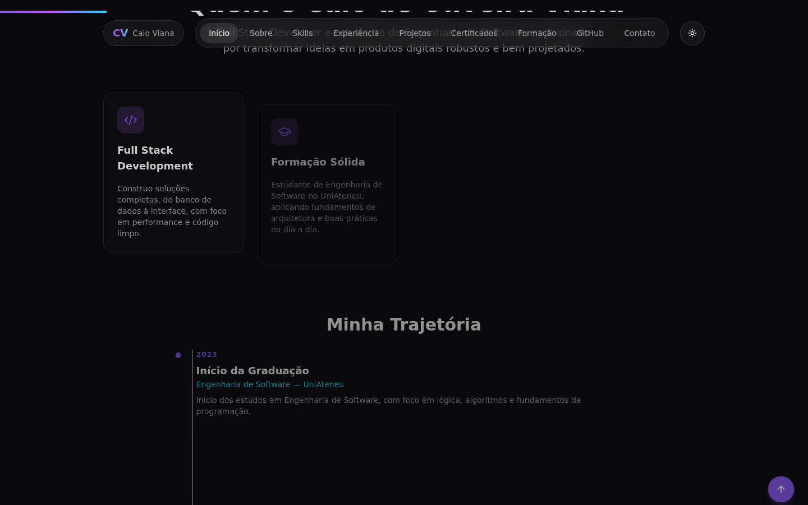
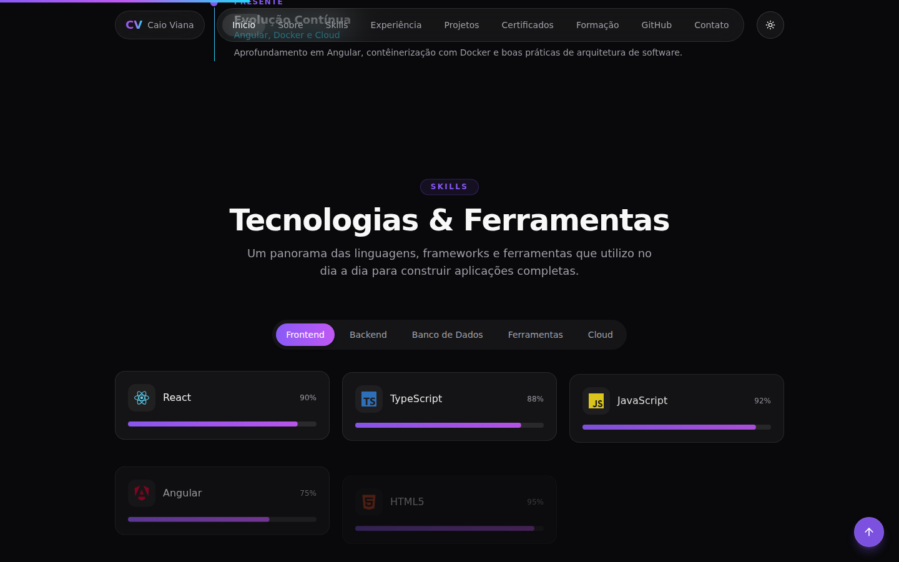
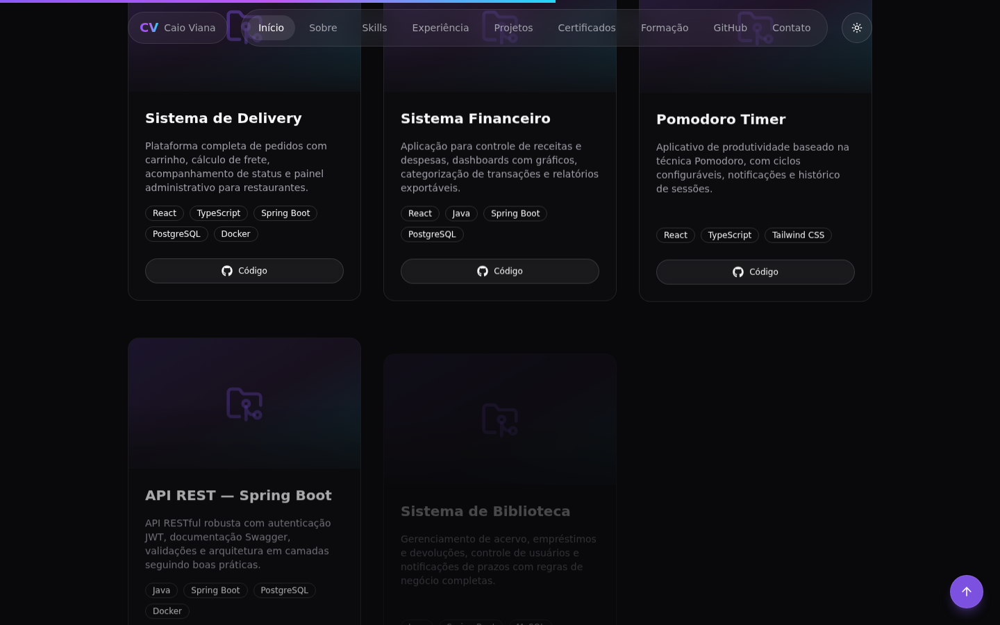
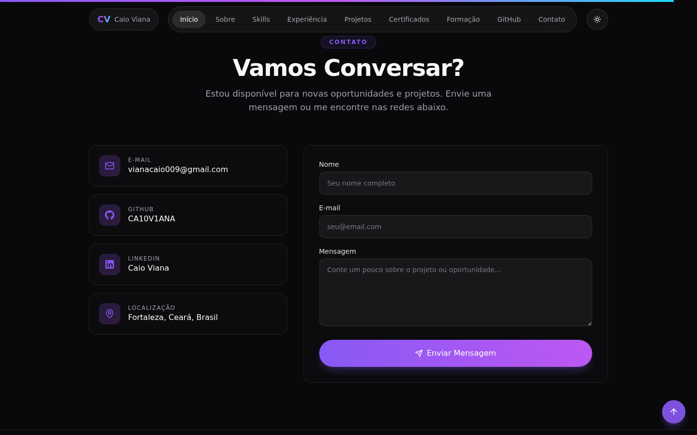

# Caio de Oliveira Viana — Portfólio Profissional

Portfólio pessoal de **Caio de Oliveira Viana**, Full Stack Developer e estudante de
Engenharia de Software, construído como uma aplicação React 19 moderna, com foco em
performance, arquitetura escalável e uma experiência visual premium (tema escuro,
glassmorphism, animações fluidas com Framer Motion).

<p align="center">
  
</p>

<p align="center">
  
  
  
  
  
</p>

---

## ✨ Sobre o projeto

Este repositório contém o código-fonte do meu portfólio, desenvolvido como um produto
real — não apenas uma página estática — utilizando as práticas e ferramentas mais
modernas do ecossistema React: componentização, hooks customizados, tipagem forte,
code-splitting, acessibilidade e integração com APIs externas (GitHub e EmailJS).

## 🚀 Tecnologias

| Categoria   | Tecnologias                                                            |
| ----------- | ---------------------------------------------------------------------- |
| Core        | React 19, TypeScript, Vite 6                                           |
| Roteamento  | React Router DOM                                                       |
| Estilização | Tailwind CSS, tailwindcss-animate, shadcn/ui (Radix UI primitives)     |
| Animações   | Framer Motion                                                          |
| Ícones      | React Icons, Lucide React                                              |
| Integrações | Axios (API pública do GitHub), EmailJS (formulário de contato), Sonner |
| Qualidade   | ESLint 9, Prettier, TypeScript strict mode                             |
| Deploy      | GitHub Pages (GitHub Actions), Vercel                                  |

## 🧩 Funcionalidades

- **Hero em tela cheia** com background aurora animado, texto com efeito de
  digitação (typewriter) e botões com efeito magnético.
- **Tema escuro por padrão** com alternância para tema claro, persistido em
  `localStorage`.
- **Seções completas**: Sobre, Skills, Experiência, Projetos, Formação, GitHub
  e Contato.
- **Skills categorizadas** (Frontend, Backend, Banco de Dados, Ferramentas,
  Cloud) com nível de proficiência, ícone e animações de hover.
- **Cards de projeto com efeito tilt 3D**, badges de tecnologias e links para
  código-fonte/demo.
- **Seção GitHub dinâmica**: consome a API pública do GitHub via Axios para
  exibir avatar, seguidores, repositórios, linguagens mais usadas, além de
  cards de estatísticas e streak de contribuições.
- **Formulário de contato funcional** com EmailJS, validação de campos e
  notificações via toast (sucesso/erro).
- **Extras de produto premium**: cursor customizado, barra de progresso de
  scroll, botão "voltar ao topo", loader inicial, glassmorphism e transições
  suaves entre seções.
- **Performance**: code-splitting por seção com `React.lazy` + `Suspense`,
  `ErrorBoundary` por seção e imagens com `loading="lazy"`.
- **Acessibilidade e SEO**: meta tags, Open Graph, favicon, `aria-label`s e
  HTML semântico.

## 📸 Screenshots

| Hero                                  | Sobre                                   |
| ------------------------------------- | --------------------------------------- |
|  |  |

| Skills                                    | Projetos                                      |
| ----------------------------------------- | --------------------------------------------- |
|  |  |

| Contato                                     | Tema Claro                                         |
| ------------------------------------------- | -------------------------------------------------- |
|  |  |

## 🗂️ Estrutura do projeto

```
src/
├── assets/            # Imagens e arquivos estáticos
├── components/
│   ├── layout/         # Navbar, Footer
│   ├── sections/       # Hero, About, Skills, Experience, Projects...
│   ├── shared/          # Reveal, TiltCard, MagneticButton, AuroraBackground...
│   └── ui/              # Primitivas shadcn/ui (Button, Card, Tabs, Dialog...)
├── context/            # ThemeProvider / ThemeContext
├── data/                # Conteúdo estático tipado (skills, projetos, experiência...)
├── hooks/               # useTheme, useGithubData, useContactForm, useActiveSection...
├── lib/                 # utils (cn), constants (dados pessoais, links)
├── pages/               # Home, NotFound
├── types/               # Interfaces e tipos compartilhados
├── App.tsx
└── main.tsx
```

## ⚙️ Como executar localmente

Pré-requisitos: [Node.js](https://nodejs.org/) 20+ e npm.

```bash
# Clonar o repositório
git clone https://github.com/CA10V1ANA/Portfolio.git
cd Portfolio

# Instalar dependências
npm install

# Rodar em modo desenvolvimento
npm run dev
```

A aplicação estará disponível em `http://localhost:5173`.

### Variáveis de ambiente

O formulário de contato utiliza o [EmailJS](https://www.emailjs.com/). Copie o
arquivo `.env.example` para `.env` e preencha com suas credenciais:

```bash
cp .env.example .env
```

```env
VITE_EMAILJS_SERVICE_ID=your_service_id
VITE_EMAILJS_TEMPLATE_ID=your_template_id
VITE_EMAILJS_PUBLIC_KEY=your_public_key
```

### Scripts disponíveis

| Script                   | Descrição                                           |
| ------------------------ | --------------------------------------------------- |
| `npm run dev`            | Inicia o servidor de desenvolvimento                |
| `npm run build`          | Gera o build de produção em `dist/`                 |
| `npm run build:gh-pages` | Gera o build com o `base path` do GitHub Pages      |
| `npm run preview`        | Serve o build de produção localmente                |
| `npm run lint`           | Executa o ESLint                                    |
| `npm run format`         | Formata o código com Prettier                       |
| `npm run deploy`         | Publica o build no GitHub Pages (branch `gh-pages`) |

## 🚢 Deploy

### GitHub Pages

O deploy é automatizado via GitHub Actions (`.github/workflows/deploy.yml`):
a cada push na branch `main`, o workflow instala as dependências, executa o
lint, gera o build com o base path correto e publica no GitHub Pages.

Também é possível publicar manualmente:

```bash
npm run deploy
```

O projeto inclui o truque de redirecionamento de SPA para GitHub Pages
(`public/404.html` + script em `index.html`), permitindo que rotas profundas
do React Router funcionem corretamente em um projeto hospedado em um
subdiretório (`/Portfolio/`).

### Vercel

O repositório já inclui um `vercel.json` com o rewrite necessário para SPAs.
Basta importar o repositório no [Vercel](https://vercel.com/new) — o build
command (`npm run build`) e o output directory (`dist`) são detectados
automaticamente.

## 📄 Licença

Este projeto está sob a licença MIT. Veja o arquivo [LICENSE](LICENSE) para
mais detalhes.

---

Desenvolvido por **Caio de Oliveira Viana**
[GitHub](https://github.com/CA10V1ANA) ·
[LinkedIn](https://www.linkedin.com/in/caio-viana-898811312)
